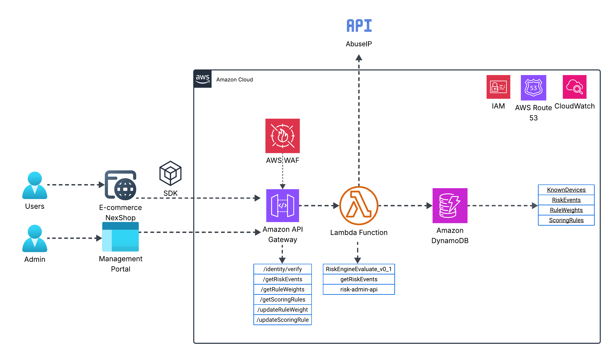
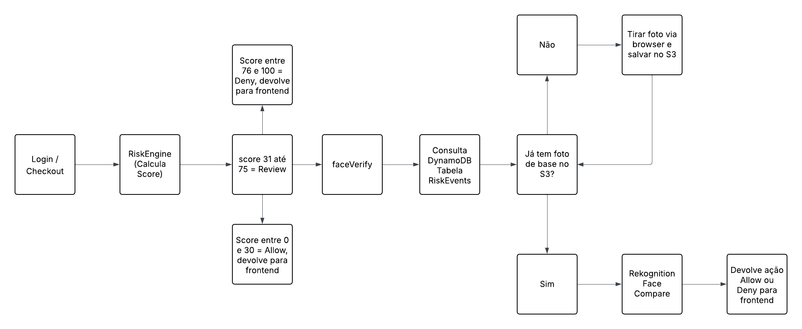

# Score Trust

**Score Trust** é uma solução serverless de análise de risco em tempo real, desenvolvida para e-commerces que desejam mitigar fraudes no momento de login ou navegação sensível. A função principal é calcular um **risk score** com base em reputação de IP, características do dispositivo, idioma, timezone e outros sinais comportamentais, permitindo decisões automatizadas com validação biometrica facial que pode resultar em ações como: `ALLOW`, `REVIEW` ou `DENY`.

---

# 📌 Sumário do Projeto Score Trust

Este repositório contém os principais componentes do projeto **Score Trust**, organizados nos seguintes diretórios:

## 🔙 Backend
- [Backend](https://github.com/luizpessol/score-trust/tree/main/backend)  
  Contém as funções **Lambda**, integrações com o **DynamoDB** e a lógica principal de avaliação de risco.

## 🖥️ Frontend
- [Frontend](https://github.com/luizpessol/score-trust/tree/main/frontend)  
  Interface web desenvolvida em **React** para visualização e gerenciamento dos eventos de risco.

## 🧪 Insomnia
- [Insomnia](https://github.com/luizpessol/score-trust/tree/main/insomnia)  
  Coleção de requests para testar as APIs do projeto diretamente no **Insomnia**.

## 📦 SDK.js
- [SDK.js](https://github.com/luizpessol/score-trust/tree/main/sdk)  
  Biblioteca em **JavaScript** para integração do Score Trust em plataformas externas (ex: e-commerce).


## 🧠 Como funciona?

1. O **e-commerce** utiliza um **SDK** para enviar dados do usuário para a API `/identity/verify`.
2. O tráfego passa pelo **AWS WAF**, segue para o **API Gateway** e é roteado para uma **função AWS Lambda**.
3. A Lambda calcula um score de risco com base em:
   - Reputação IP (via [AbuseIPDB](https://www.abuseipdb.com))
   - Dispositivo conhecido
   - Idioma e timezone
   - User-Agent suspeito
   - Registro e verificação facial
4. O score é armazenado no **DynamoDB** junto com os detalhes do evento.
5. A decisão (`ALLOW`, `REVIEW`, `DENY`) é enviada de volta ao cliente.
6. Administradores podem visualizar eventos na dashboard via `/getRiskEvents`.

---

## 🧩 Arquitetura



### Principais componentes:

| Componente               | Função                                                                 |
|--------------------------|------------------------------------------------------------------------|
| **E-commerce**           | Cliente que consome o SDK para análise de risco                        |
| **AWS WAF**              | Proteção contra ataques na borda                                       |
| **API Gateway**          | Expõe as rotas, exemplo: `/identity/verify`, `/identity/face-verify` e `/getRiskEvents`         |
| **Lambda**               | Lógica de cálculo e persistência do score                              |
| **DynamoDB**             | Armazena regras, pesos, dispositivos e eventos                         |
| **Route 53**             | Registro e gerenciamento do domínio `score-trust.com`                  |
| **Certificate Manager**  | Criação e Gerenciamento dos `Certificados SSL` das APIs                |
| **CloudWatch**           | Registro de todos os Logs                                              |
| **IAM**                  | Gerenciamento de identidade dos usuários AWS                           |
| **AbuseIPDB API**        | Verifica reputação de IPs públicos                                     |
| **Dashboard**            | Interface administrativa para consulta de eventos e update de regras   |

---

## 🧮 Cálculo do Score

A lógica de score considera diversos pesos configuráveis via tabela `RuleWeights`, e aplica regras mapeadas na tabela `ScoringRules`.

### Exemplos de critérios:
- Dispositivo não reconhecido
- Timezone não esperado (fora de `America/Sao_Paulo`, `America/Buenos_Aires`)
- Idioma não-PT
- User-Agent com headless/phantom
- IP com alto score no AbuseIPDB
- País diferente de BR
- Registro facial
- Verificação da biometria facial

O score final é limitado a **100 pontos** e categorizado conforme o intervalo definido em `ScoringRules`.

### 📐 Regras e Pesos de Pontuação

| ⚙️ Regra (ID)          | 📝 Descrição                                     | ⚖️ Peso |
|-----------------------|--------------------------------------------------|--------|
| face_biometricVerified| Se o biometricVerified = false                   | 25     |
| useragent_suspeito    | User Agent suspeito (ex: headless browser)       | 50     |
| device_unknown        | Dispositivo não reconhecido                      | 40     |
| idioma_nao_pt         | Idioma não típico detectado                      | 10     |
| timezone_inesperado   | Timezone inesperado                              | 20     |
| pais_nao_br           | País de origem não é 🇧🇷 Brasil                 | 80     |
| ip_privado            | IP privado ou suspeito detectado                 | 40     |
| device_known          | Dispositivo já reconhecido                       | 10     | 
| abuseipdb_alto        | IP com reputação ruim no AbuseIPDB               | 20     |

### 🧠 Ações baseadas no Score Final

| 🆔 ID | 🎯 Score          | 🔍 Ação sugerida |
|-------|-------------------|------------------|
| r1    | 0 - 30            | ✅ Allow         |
| r2    | 31 - 75           | ⚠️  Review        |
| r3    | 76 - 100          | 🚫 Deny          |

---

## 🗃️ Estrutura das Tabelas (DynamoDB)

- `KnownDevices` — Dispositivos autorizados previamente
- `RiskEvents` — Log de todos os eventos com score, IP, e decisão
- `RuleWeights` — Pesos atribuídos a cada fator de risco
- `ScoringRules` — Mapeamento de score para ação (e.g. `0-30 = ALLOW`)

---

## 🧩 AFluxo de decisão da aplicação



---

## 🧪 Exemplo de retorno da API

```json
{
  "score": 68,
  "action": "REVIEW",
  "reason": [
    "Dispositivo não reconhecido",
    "Timezone inesperado",
    "País de origem não é Brasil"
  ]
}
```

## 🔐 Segurança
- IAM Roles para integração/consumo de recusos AWS

- AWS WAF integrado para validações na borda

- Plano de serviço para mitigação de uso das APIs

- APIs segmentas por tipo de utilização: usuário x administrador

- API Key configurado para consumo dos Planos de serviço/APIs

- Score configurável sem alterar o código (via DynamoDB)

- KMS para criptografia dos dados em repouso

- Certificado SSL para comunição segura

- AWS CloudWatch para consolidação dos Logs

- TTL automático para eventos (7 dias por padrão)

- Requisições limitadas ao SDK e Dashboard autenticados

## 🚀 Tecnologias Utilizadas
- AWS ( API Gateway, Lambda, DynamoDB, Route 53, IAM, CloudWatch, Certificate Manager e WAF

- AbuseIPDB (external API)

- Python 3.13

- SDK customizado em JavaScript (Hospedado no servidor do cliente)

## 📌 Observações
Este documentação é apenas da função de backend (score engine).

A solução foi desenhada para ser modular e expansível (ex: Face Liveness, reanálise, alertas).

## 🧭 Próximos Passos
- Desenvolvimento de um portal/Dashboard de gerenciamento do serviço

- Desenvolvimento do sistema de biometria facial para status `REVIEW`

- Módulo de aprendizado contínuo para ajuste automático de pesos

## 👨‍💻 Autor
`Desenvolvido por:` Adrian Wicke, Ana Carolina, Camille, Demetrio Paszko e Luiz Pessol.

---

## 📄 Licença

Uso interno e demonstração. Para uso comercial, consulte a equipe do projeto Score Trust.

--- 
